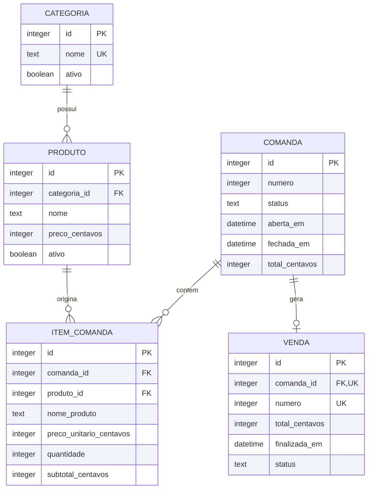

# Modelagem de dados

## Modelo conceitual

Não existe entidade de pagamento no MVP.

## Entidades

### CATEGORIA

| Campo | Tipo | Obrigatório | Regra |
| --- | --- | --- | --- |
| id | INTEGER | Sim | Chave primária |
| nome | TEXT | Sim | Único sem diferenciar maiúsculas |
| ativo | INTEGER | Sim | `0` ou `1` |
| criado_em | TEXT | Sim | ISO 8601 local |
| atualizado_em | TEXT | Sim | ISO 8601 local |

### PRODUTO

| Campo | Tipo | Obrigatório | Regra |
| --- | --- | --- | --- |
| id | INTEGER | Sim | Chave primária |
| categoria_id | INTEGER | Sim | FK para categoria |
| nome | TEXT | Sim | Nome visível |
| preco_centavos | INTEGER | Sim | Maior que zero |
| ativo | INTEGER | Sim | `0` ou `1` |
| foto_arquivo | TEXT | Não | Nome do arquivo da foto; guarda só o nome (nunca o caminho absoluto), resolvido contra a pasta de fotos do app |
| criado_em | TEXT | Sim | Data de criação |
| atualizado_em | TEXT | Sim | Última alteração |

### COMANDA

| Campo | Tipo | Obrigatório | Regra |
| --- | --- | --- | --- |
| id | INTEGER | Sim | Identificador interno nunca reutilizado |
| numero | INTEGER | Sim | Número visível positivo e reutilizável |
| status | TEXT | Sim | `ABERTA`, `FECHADA` ou `CANCELADA` |
| aberta_em | TEXT | Sim | Abertura |
| fechada_em | TEXT | Não | Encerramento ou cancelamento |
| total_centavos | INTEGER | Sim | Soma materializada dos itens |
| observacao | TEXT | Não | Nota operacional sem dado pessoal obrigatório |

### ITEM_COMANDA

| Campo | Tipo | Obrigatório | Regra |
| --- | --- | --- | --- |
| id | INTEGER | Sim | Chave primária |
| comanda_id | INTEGER | Sim | FK para comanda |
| produto_id | INTEGER | Sim | FK para produto de origem |
| nome_produto | TEXT | Sim | Cópia histórica |
| preco_unitario_centavos | INTEGER | Sim | Cópia histórica positiva |
| quantidade | INTEGER | Sim | Inteiro positivo |
| subtotal_centavos | INTEGER | Sim | Preço multiplicado pela quantidade |
| observacao | TEXT | Não | Nota do item |
| criado_em | TEXT | Sim | Primeiro lançamento |
| atualizado_em | TEXT | Sim | Última correção |

### VENDA

| Campo | Tipo | Obrigatório | Regra |
| --- | --- | --- | --- |
| id | INTEGER | Sim | Chave primária |
| comanda_id | INTEGER | Sim | FK única para comanda |
| numero | INTEGER | Sim | Sequencial interno único |
| total_centavos | INTEGER | Sim | Total revalidado maior que zero |
| finalizada_em | TEXT | Sim | Encerramento |
| status | TEXT | Sim | `CONCLUIDA` no MVP |

VENDA registra o encerramento comercial, não o pagamento.

### CONFIGURACAO

| Campo | Tipo | Obrigatório | Regra |
| --- | --- | --- | --- |
| chave | TEXT | Sim | Chave primária |
| valor | TEXT | Sim | Valor serializado e validado |
| atualizado_em | TEXT | Sim | Última alteração |

### BACKUP_REGISTRO

| Campo | Tipo | Obrigatório | Regra |
| --- | --- | --- | --- |
| id | INTEGER | Sim | Chave primária |
| arquivo | TEXT | Sim | Nome da cópia |
| destino | TEXT | Sim | Pasta usada |
| criado_em | TEXT | Sim | Início da operação |
| status | TEXT | Sim | `SUCESSO` ou `FALHA` |
| checksum | TEXT | Não | Hash da cópia válida |
| mensagem | TEXT | Não | Resumo técnico não sensível |

## Índices obrigatórios

- índice único parcial em `comanda(numero)` quando `status = 'ABERTA'`;
- índice em `produto(categoria_id, ativo)`;
- índice em `item_comanda(comanda_id)`;
- restrição única em `venda(comanda_id)`;
- índice em `venda(finalizada_em)`.

## Exclusão

Registros históricos não são excluídos em cascata. Produto e categoria com uso anterior devem ser desativados. A implementação deve usar `ON DELETE RESTRICT` nas referências históricas.

