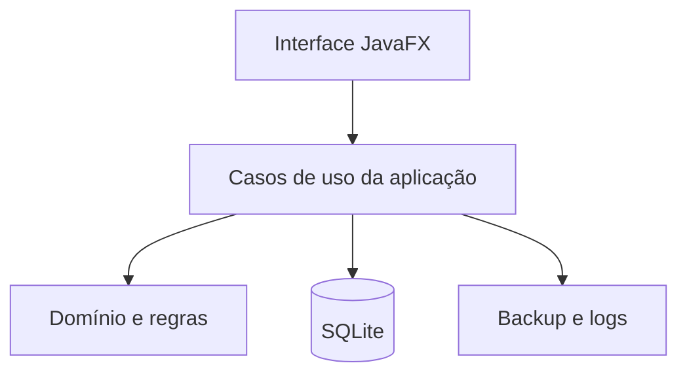

# Arquitetura

## Visão

Aplicativo desktop modular, executado em um computador, com banco SQLite no mesmo equipamento. O MVP não possui backend remoto nem API de pagamento.



## Componentes

| Componente | Responsabilidade | Não deve fazer |
| --- | --- | --- |
| Interface | Navegação, entrada, mensagens e estado visual | Executar SQL ou conter regra crítica |
| Aplicação | Orquestrar casos de uso e transações | Depender de controles JavaFX |
| Domínio | Entidades, estados, cálculos e invariantes | Conhecer SQLite, arquivo ou tela |
| Persistência | Consultas, mapeamento e migrações | Decidir regra de negócio |
| Backup | Snapshot, validação, retenção e restauração | Modificar venda ou comanda |
| Observabilidade | Logs técnicos e diagnóstico | Registrar cartão, senha ou dado pessoal desnecessário |

## Estrutura sugerida

```text
app/
  atendimento/
    domain/
    application/
    persistence/
    ui/
  catalogo/
    domain/
    application/
    persistence/
    ui/
  venda/
    domain/
    application/
    persistence/
    ui/
  backup/
  configuracao/
  shared/
```

Organização por domínio é preferida. Dentro de cada domínio, separe responsabilidades de negócio, aplicação, persistência e interface.

## Stack proposta

- Java 21 LTS;
- JavaFX;
- SQLite;
- JDBC;
- Flyway ou executor próprio de migrações;
- JUnit;
- TestFX somente nos fluxos críticos de interface;
- `jpackage`.

## Transações

Devem ser transacionais:

- abertura de comanda e ocupação do número;
- inclusão, alteração ou remoção de item com atualização do total;
- encerramento com criação de venda e mudança de status;
- cancelamento e liberação do número;
- aplicação de migração.

## Integração futura com maquininha

Deve ser um adaptador opcional, nunca uma dependência do domínio. Uma interface futura pode seguir o formato:

```text
TerminalPagamento
  iniciarCobranca(valorCentavos, referencia)
  consultarSituacao(referencia)
  cancelarCobranca(referencia)
```

Essa interface não será implementada no MVP. O comportamento atual é um adaptador manual que apenas exibe o total e aguarda confirmação humana.

## Decisões arquiteturais

- [ADR 0001 Aplicação desktop local](adr/0001-aplicacao-desktop-local.md)
- [ADR 0002 SQLite](adr/0002-sqlite.md)
- [ADR 0003 Pagamento fora do MVP](adr/0003-pagamento-fora-mvp.md)

