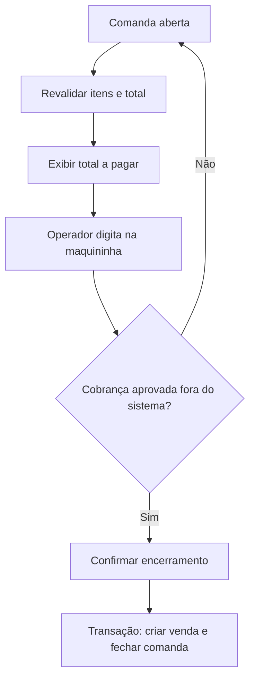

# Guia de implementação

Este é o documento operacional para construir o MVP somente com base no repositório.

## Etapa 0 Validar ambiente

### Tarefas

- responder QV01, QV02 e completar QV07;
- instalar o SDK do .NET 10 no computador de desenvolvimento;
- confirmar C# WPF MVVM Entity Framework Core e SQLite;
- definir `%LOCALAPPDATA%\VarthexComanda` como raiz de dados;
- confirmar a arquitetura de publicação `win-x64` ou substituí-la pela arquitetura homologada;
- configurar testes e integração contínua.

### Saída

Aplicativo vazio inicia pelo comando de desenvolvimento e pelo pacote instalado.

## Etapa 1 Base e banco

### Tarefas

- criar módulos definidos em [Arquitetura](06-arquitetura.md);
- criar a solução e os projetos conforme [Plataforma Windows e .NET](19-plataforma-windows-dotnet.md);
- configurar SQLite com `foreign_keys = ON`;
- configurar Entity Framework Core e migrações versionadas;
- aplicar [schema.sql](../database/schema.sql);
- criar abstração de relógio e transação;
- implementar logs locais;
- implementar mutex de instância única;
- testar inicialização e migração repetida.

### Critérios

- banco é criado fora da pasta de executáveis;
- iniciar duas vezes não duplica estrutura;
- falha de migração preserva base anterior;
- aplicação funciona sem rede.
- segunda execução informa que o aplicativo já está aberto e termina com segurança;
- banco, logs e backups ficam fora da pasta publicada.

## Etapa 2 Catálogo

Implementar RF01 a RF05.

### Ordem

1. entidade e repositório de categoria;
2. entidade e repositório de produto;
3. serviços de cadastro e alteração;
4. desativação em vez de exclusão;
5. tela de listagem e formulário;
6. busca e filtro;
7. testes de validação e histórico.

### Critérios

- preço é convertido para centavos sem `double`;
- produto inativo não aparece para novo lançamento;
- alteração de preço não muda item existente.

## Etapa 3 Comandas e itens

Implementar RF06 a RF13.

### Ordem

1. grade de números;
2. abertura transacional;
3. catálogo rápido;
4. inclusão com snapshot de nome e preço;
5. incremento e alteração de quantidade;
6. remoção confirmada;
7. recálculo do total;
8. cancelamento;
9. testes de concorrência do número.

### Critérios

- uma única comanda aberta por número;
- ação comum responde em até 500 ms;
- produto frequente entra em até dois cliques;
- subtotal e total obedecem aos invariantes.

## Etapa 4 Total e encerramento

Implementar RF14 a RF17.

### Fluxo obrigatório



### Proibições

- não criar tela de forma de pagamento;
- não calcular troco;
- não chamar API de adquirente;
- não armazenar token, NSU, cartão ou autorização;
- não encerrar automaticamente por tempo.

### Critérios

- comanda vazia é recusada;
- voltar não altera a comanda;
- confirmação repetida não duplica venda;
- falha transacional mantém comanda aberta;
- venda e comanda são gravadas juntas.

## Etapa 5 Histórico e resumo

Implementar RF18 a RF20.

- filtrar vendas por data;
- localizar pelo número da comanda;
- mostrar snapshot dos itens;
- totalizar somente vendas concluídas;
- calcular ticket médio;
- mostrar estado vazio.

O histórico não deve mostrar forma de pagamento.

## Etapa 6 Backup e recuperação

Implementar RF21 a RF24 conforme [Segurança e backup](08-seguranca-backup.md).

Não considerar concluído até restaurar uma cópia em pasta de teste.

## Etapa 7 Configuração e acabamento

Implementar RF25 a RF27, recuperação de comandas abertas, rotação de logs, navegação por teclado, mensagens, publicação autocontida e instalação limpa.

## Etapa 8 Homologação

1. executar CT01 a CT22;
2. executar massa mínima;
3. testar sem internet;
4. testar no computador real;
5. simular erro na maquininha e confirmar que a comanda permanece aberta;
6. restaurar backup;
7. treinar os operadores;
8. registrar pendências restantes.

## Comandos da plataforma

Os comandos de criação da solução, referências, pacotes, migrações, testes e publicação estão centralizados em [Plataforma Windows e .NET](19-plataforma-windows-dotnet.md). Não duplicar versões ou opções de publicação em scripts diferentes sem atualizar esse documento.

## Ordem sugerida de branches

```text
chore/base-projeto
feature/migracoes-sqlite
feature/catalogo
feature/grade-comandas
feature/itens-comanda
feature/total-encerramento
feature/historico-resumo
feature/backup-restauracao
chore/empacotamento
test/homologacao-mvp
```
